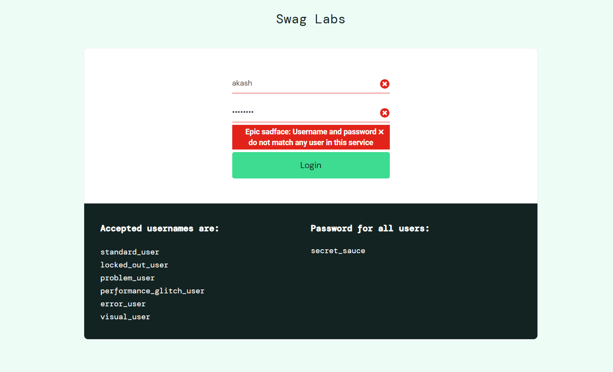
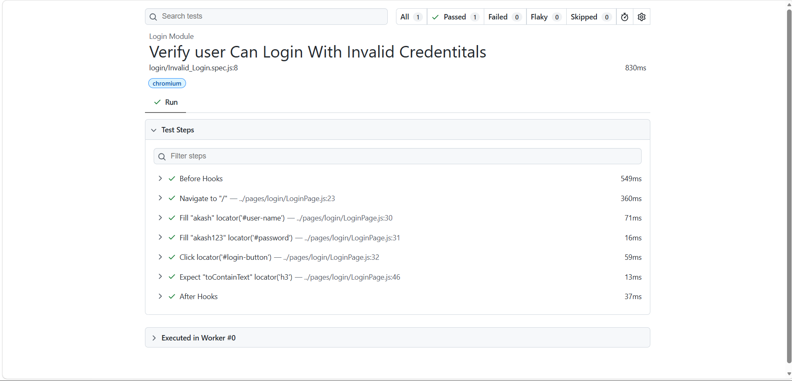

# 🚀 Task-002: Verify Invalid Login Functionality | Playwright JavaScript Automation


---

# 📖 Overview

This task automates the **Invalid Login** functionality of the **SauceDemo** web application using **Playwright with JavaScript**.

The automation verifies that users cannot log in using invalid credentials and that the application displays the appropriate error message while preventing access to the Inventory page.

The framework follows the **Page Object Model (POM)** design pattern and industry-standard automation practices.

---

# 🎯 Objective

- Verify login with invalid credentials.
- Validate the displayed error message.
- Ensure the user remains on the Login page.
- Ensure unauthorized users cannot access the Inventory page.

---

# 🌐 Application Under Test

| Property | Value |
|-----------|-------|
| Application | SauceDemo |
| URL | https://www.saucedemo.com |
| Module | Login |
| Scenario | Invalid Login |
| Environment | Demo |

---

# 📋 Test Case Details

| Field | Details |
|--------|---------|
| Task ID | TASK-002 |
| Test Scenario | Verify Invalid Login |
| Testing Type | Functional Testing |
| Automation Tool | Playwright |
| Programming Language | JavaScript |
| Framework | Playwright Test |
| Design Pattern | Page Object Model (POM) |
| Browser | Chromium |
| Priority | High |
| Severity | Critical |
| Status | ✅ Passed |

---

# 📌 Business Requirement

The application should authenticate only valid users.

When invalid credentials are entered:

- User should remain on the Login page.
- Appropriate error message should be displayed.
- User should not be redirected to the Inventory page.

---

# 🛠 Technology Stack

- Playwright
- JavaScript (ES6)
- Node.js
- Visual Studio Code
- Git
- GitHub
- Page Object Model (POM)

---

# 📂 Project Structure

```text
playwright-javascript-automation
│
├── pages
│   └── login
│       └── LoginPage.js
│
├── tests
│   └── login
│       └── Login.spec.js
│
├── docs
│   └── task-002
│       ├── README.md
│       └── screenshots
│           ├── invalid-login.png
│           └── playwright-report.png
│
├── playwright.config.js
├── package.json
└── package-lock.json
```

---

# 🧪 Test Data

| Username | Password | Expected Result |
|-----------|----------|-----------------|
| invalid_user | invalid_password | Error Message Displayed |

---

# 📝 Test Steps

| Step | Action | Expected Result |
|------|--------|-----------------|
| 1 | Launch Browser | Browser launches successfully |
| 2 | Navigate to SauceDemo | Login page displayed |
| 3 | Enter Invalid Username | Username entered |
| 4 | Enter Invalid Password | Password entered |
| 5 | Click Login Button | Login request submitted |
| 6 | Verify Error Message | Error message displayed |
| 7 | Verify URL | User remains on Login page |

---

# 🔄 Test Flow

```text
Launch Browser
      │
      ▼
Open SauceDemo
      │
      ▼
Enter Invalid Username
      │
      ▼
Enter Invalid Password
      │
      ▼
Click Login Button
      │
      ▼
Verify Error Message
      │
      ▼
Verify Login Page URL
      │
      ▼
Test Passed ✅
```

---

# ✅ Expected Result

- Login should fail.
- Error message should be displayed.
- User should remain on the Login page.
- Inventory page should not be accessible.

---

# ⚙ Automation Approach

- Page Object Model (POM)
- Reusable Login Method
- CSS Locators
- Playwright Assertions
- Async / Await
- Clean Code Structure

---

# 🎯 Playwright Concepts Used

- Playwright Test Runner
- Page Object Model (POM)
- Locators
- Assertions
- Browser Automation
- Async / Await
- Navigation
- URL Validation

---

# ✔ Assertions Used

- Verify Error Message
- Verify Login Page URL
- Verify Inventory Page is NOT Accessible

---

# ▶ Test Execution

### Run All Tests

```bash
npx playwright test
```

### Run Login Module

```bash
npx playwright test tests/login/Login.spec.js --headed
```

### Show HTML Report

```bash
npx playwright show-report
```

---

# 🌍 Browser

| Browser | Status |
|----------|--------|
| Chromium | ✅ Passed |

---

# 📊 Test Execution Summary

| Browser | Result |
|----------|--------|
| Chromium | Passed |

---

# 📸 Screenshots

## Invalid Login Error

The application correctly displays an error message when invalid credentials are entered.



---

## Playwright HTML Report

The Playwright HTML Report confirms successful execution of the test.



---

# 🌿 Git Information

### Repository

```
playwright-javascript-automation
```

### Branch

```
feature/task-002-invalid-login
```

### Commit Message

```
feat(task-002): automate invalid login functionality using Playwright POM
```

---

# 📚 Learning Outcome

After completing this task, I learned:

- Negative Testing
- Error Message Validation
- Playwright Assertions
- Page Object Model
- Reusable Methods
- Git Feature Branch Workflow
- GitHub Documentation

---

# 🚀 Skills Demonstrated

- Playwright Automation
- JavaScript
- Functional Testing
- Negative Testing
- Assertions
- Page Object Model
- Git
- GitHub
- Browser Automation

---

# 🔜 Next Task

## Task-003: Verify Page Title

**Status:** ⏳ Pending

---

# 👨‍💻 Author

**Akash Atnure**

Aspiring QA Automation Engineer

GitHub: https://github.com/your-github-username

LinkedIn: https://linkedin.com/in/your-linkedin-profile

---

# ⭐ If you found this project useful, consider giving it a Star!

Thank you for visiting my Playwright Automation Portfolio.
