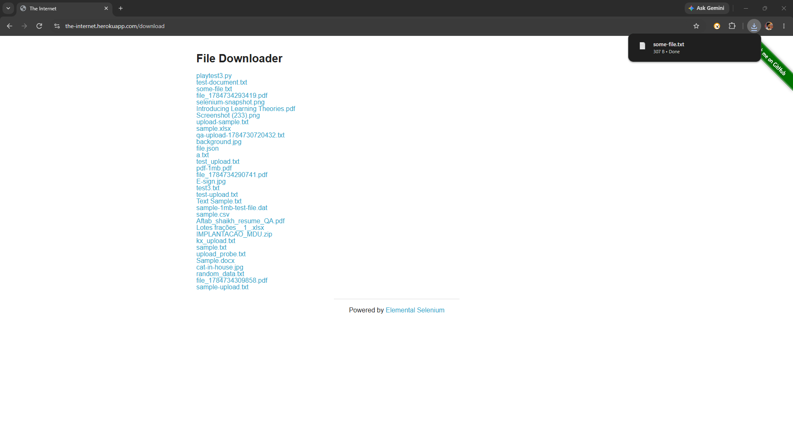
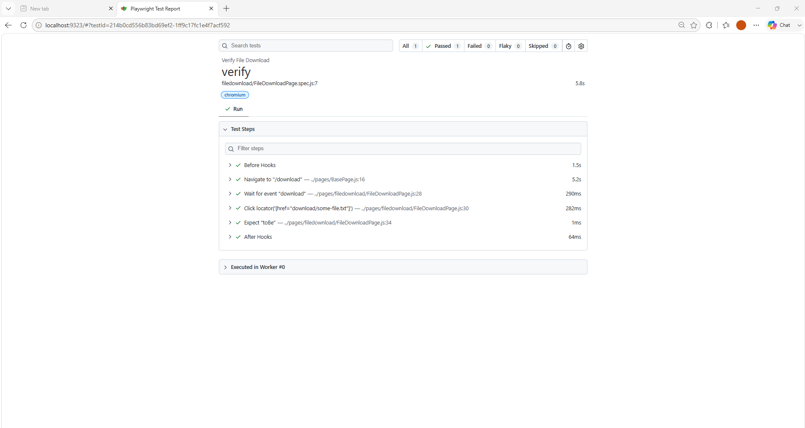

# 🚀 Task-013: Verify File Download | Playwright JavaScript Automation


---

# 📖 Project Overview

This project automates the **File Download** functionality of **The Internet Herokuapp** using **Playwright with JavaScript**.

The objective of this task is to verify that a user can successfully download a file and validate the downloaded filename.

The automation is developed by following **IT Industry Standards** using the **Page Object Model (POM)** design pattern.

---

# 📌 Business Requirement

The application should allow users to download a file successfully.

The downloaded filename should match the expected filename.

---

# 🎯 Objective

To verify that a file is downloaded successfully and the downloaded filename is validated.

---

# 📋 Test Case Information

| Field | Details |
|--------|---------|
| **Task ID** | TASK-013 |
| **Module** | File Download |
| **Feature** | Download File |
| **Scenario** | Verify File Download |
| **Testing Type** | Functional Testing |
| **Automation** | Yes |
| **Priority** | High |
| **Severity** | Medium |
| **Framework** | Playwright |
| **Language** | JavaScript |
| **Design Pattern** | Page Object Model (POM) |
| **Execution Status** | ✅ Passed |

---

# 🌐 Application Under Test

| Property | Value |
|----------|-------|
| Application | The Internet Herokuapp |
| URL | https://the-internet.herokuapp.com/download |
| Environment | Demo |

---

# 🛠 Technology Stack

| Technology | Details |
|------------|----------|
| Automation Tool | Playwright |
| Programming Language | JavaScript |
| Runtime | Node.js |
| IDE | Visual Studio Code |
| Version Control | Git |
| Repository | GitHub |
| Design Pattern | Page Object Model |

---

# 📁 Project Structure

```text
playwright-javascript-automation
│
├── pages
│   └── filedownload
│       └── FileDownloadPage.js
│
├── tests
│   └── filedownload
│       └── FileDownloadPage.spec.js
│
├── testdata
│   └── file_download_data.json
│
├── utils
│   └── constants.js
│
├── playwright.config.js
├── package.json
├── package-lock.json
└── README.md
```

---

# 📂 Folder Description

| Folder | Purpose |
|---------|----------|
| **pages** | Contains Page Object classes |
| **tests** | Contains Playwright test scripts |
| **testdata** | Stores JSON test data |
| **utils** | Stores reusable constants |
| **README.md** | Project documentation |

---

# 📌 Preconditions

- Node.js installed
- Playwright installed
- Browser dependencies installed
- Internet connection available
- The Internet Herokuapp website accessible

---

# 🧪 Test Data

| File Name |
|------------|
| some-file.txt |

---

# 📝 Test Steps

| Step | Action | Expected Result |
|------|----------|----------------|
| 1 | Launch Browser | Browser launches successfully |
| 2 | Navigate to Download Page | Download page is displayed |
| 3 | Click Download Link | Download starts successfully |
| 4 | Validate Downloaded Filename | Filename matches expected value |

---

# 🔄 Test Flow

```text
Launch Browser
       │
       ▼
Navigate to Download Page
       │
       ▼
Click Download Link
       │
       ▼
File Download Starts
       │
       ▼
Validate Downloaded Filename
       │
       ▼
Test Passed
```

---

# ✅ Expected Result

- Download page should load successfully.
- File should download successfully.
- Downloaded filename should match the expected filename.

---

# 📌 Post Conditions

- File downloaded successfully.
- Download validated successfully.

---

# ⚙ Automation Approach

The automation is implemented using:

- Page Object Model (POM)
- External JSON Test Data
- Reusable Methods
- Playwright Assertions
- Download Event Handling
- Async / Await Programming

---

# 🎯 Playwright Concepts Used

- Page Object Model (POM)
- Locators
- Assertions
- Download Event
- JSON Test Data
- Browser Context
- Playwright Test Runner

---

# ✔ Assertions Used

- Verify Downloaded Filename

---

# ▶ Test Execution

## Run all tests

```bash
npx playwright test
```

## Run Task-013

```bash
npx playwright test tests/filedownload/FileDownloadPage.spec.js --headed
```

## Run on Chromium

```bash
npx playwright test tests/filedownload/FileDownloadPage.spec.js --project=chromium
```

## View HTML Report

```bash
npx playwright show-report
```

---

# 🌍 Browser Support

| Browser | Status |
|----------|---------|
| Chromium | ✅ |
| Firefox | ✅ |
| WebKit | ✅ |

---

# 📊 Test Execution Summary

| Browser | Result |
|----------|---------|
| Chromium | ✅ Passed |

---

# 📷 Execution Evidence

## File Download Successfully

> Add Screenshot Here



---

## Playwright HTML Report

> Add Screenshot Here



---

# 🌿 Git Information

### Branch

```text
feature/task-013-file-download
```

### Commit Message

```text
feat(task-013): automate file download using Playwright POM
```

---

# 💡 Challenges Faced

- Understanding Playwright Download Event.
- Capturing download object.
- Validating downloaded filename.
- Maintaining reusable Page Object Model structure.

---

# 📚 Learning Outcome

After completing this task, I learned:

- File Download Automation
- Download Event Handling
- Playwright Assertions
- Page Object Model implementation
- JSON Test Data handling
- Git Feature Branch workflow
- GitHub repository management

---

# 🚀 Skills Demonstrated

- Playwright Automation
- JavaScript (ES6)
- File Download Automation
- Page Object Model (POM)
- Functional Testing
- JSON Test Data
- Assertions
- Git
- GitHub
- Version Control

---

# 🔜 Next Task

**Task-014**

✅ Verify Drag and Drop Functionality

---

# 👨‍💻 Author

**Akash Atnure**

QA Automation Engineer

GitHub

```text
https://github.com/<YOUR_GITHUB_USERNAME>
```

Repository

```text
https://github.com/<YOUR_GITHUB_USERNAME>/playwright-javascript-automation
```

---

# ⭐ If you found this project helpful, don't forget to give it a Star.

---

# 📄 License

This project is created for learning, interview preparation, and portfolio purposes.
