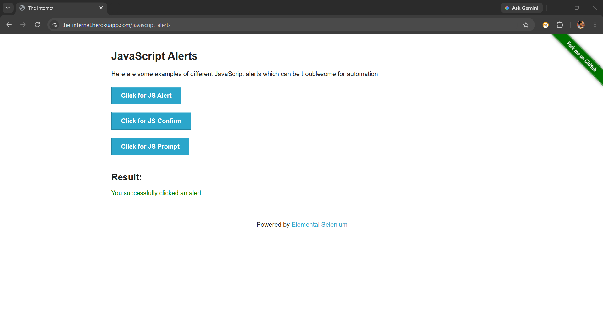
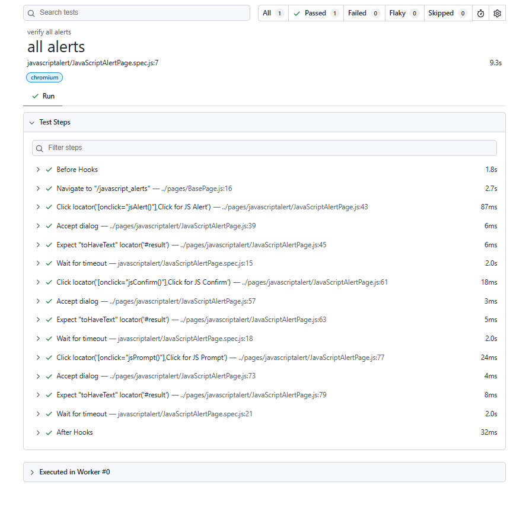

# 🚀 Task-011: Handle JavaScript Alerts | Playwright JavaScript Automation


---

# 📖 Project Overview

This project automates **JavaScript Alerts** functionality of **The Internet Herokuapp** using **Playwright with JavaScript**.

The automation validates all three JavaScript alert types in a single test execution:

- JavaScript Alert
- JavaScript Confirm Alert
- JavaScript Prompt Alert

The framework is developed using the **Page Object Model (POM)** design pattern with reusable methods and external JSON test data.

---

# 📌 Business Requirement

The application should correctly handle different JavaScript alert types.

- User should be able to accept a normal alert.
- User should be able to accept a confirmation alert.
- User should be able to enter text into a prompt alert.
- Appropriate success messages should be displayed after each action.

---

# 🎯 Objective

To verify all JavaScript Alert types are handled successfully.

---

# 📋 Test Case Information

| Field | Details |
|--------|---------|
| **Task ID** | TASK-011 |
| **Module** | JavaScript Alerts |
| **Feature** | Alert Handling |
| **Scenario** | Handle JavaScript Alert, Confirm Alert & Prompt Alert |
| **Testing Type** | Functional Testing |
| **Automation** | Yes |
| **Priority** | High |
| **Severity** | Medium |
| **Framework** | Playwright |
| **Language** | JavaScript |
| **Design Pattern** | Page Object Model (POM) |
| **Execution Status** | ✅ Passed |

---

# 🌐 Application Under Test

| Property | Value |
|----------|-------|
| Application | The Internet Herokuapp |
| URL | https://the-internet.herokuapp.com/javascript_alerts |
| Environment | Demo |

---

# 🛠 Technology Stack

| Technology | Details |
|------------|----------|
| Automation Tool | Playwright |
| Programming Language | JavaScript |
| Runtime | Node.js |
| IDE | Visual Studio Code |
| Version Control | Git |
| Repository | GitHub |
| Design Pattern | Page Object Model (POM) |

---

# 📁 Project Structure

```text
playwright-javascript-automation
│
├── pages
│   └── javascriptalert
│       └── JavaScriptAlertPage.js
│
├── tests
│   └── javascriptalert
│       └── JavaScriptAlertPage.spec.js
│
├── testdata
│   └── javascript_alert_data.json
│
├── utils
│   └── constants.js
│
├── playwright.config.js
├── package.json
├── package-lock.json
├── .gitignore
└── README.md
```

---

# 📂 Folder Description

| Folder | Purpose |
|---------|----------|
| **pages** | Contains Page Object classes |
| **tests** | Contains Playwright test scripts |
| **testdata** | Stores JSON test data |
| **utils** | Stores reusable constants |
| **README.md** | Project documentation |

---

# 📌 Preconditions

- Node.js installed
- Playwright installed
- Browser dependencies installed
- Internet connection available
- Website accessible

---

# 🧪 Test Data

| Alert Type | Input |
|------------|-------|
| JavaScript Alert | Accept |
| Confirm Alert | Accept |
| Prompt Alert | Playwright |

---

# 📝 Test Steps

| Step | Action | Expected Result |
|------|--------|----------------|
| 1 | Launch Browser | Browser launches successfully |
| 2 | Navigate to JavaScript Alerts page | Alerts page displayed |
| 3 | Click **JS Alert** | Alert accepted successfully |
| 4 | Verify success message | Message displayed |
| 5 | Click **JS Confirm** | Alert accepted successfully |
| 6 | Verify success message | Message displayed |
| 7 | Click **JS Prompt** | Enter text and accept |
| 8 | Verify entered text | Prompt message displayed |

---

# 🔄 Test Flow

```text
Launch Browser
      │
      ▼
Navigate to JavaScript Alerts Page
      │
      ▼
Handle JavaScript Alert
      │
      ▼
Verify Result
      │
      ▼
Handle Confirm Alert
      │
      ▼
Verify Result
      │
      ▼
Handle Prompt Alert
      │
      ▼
Enter Text
      │
      ▼
Verify Result
      │
      ▼
Test Passed
```

---

# ✅ Expected Result

- JavaScript Alert accepted successfully.
- Confirm Alert accepted successfully.
- Prompt Alert accepts user input.
- Appropriate success messages displayed.
- Test execution completed successfully.

---

# 📌 Post Conditions

- All alerts handled successfully.
- Validation messages displayed.
- Application ready for further testing.

---

# ⚙ Automation Approach

The automation is implemented using:

- Page Object Model (POM)
- External JSON Test Data
- Reusable Methods
- Playwright Assertions
- Dialog Event Handling
- Async / Await Programming

---

# 🎯 Playwright Concepts Used

- Page Object Model (POM)
- Locators
- Assertions
- Dialog Handling
- JavaScript Alerts
- Confirm Alerts
- Prompt Alerts
- JSON Test Data
- Browser Context
- Playwright Test Runner

---

# ✔ Assertions Used

- Verify JavaScript Alert Message
- Verify Confirm Alert Message
- Verify Prompt Alert Message

---

# ▶ Test Execution

## Run all tests

```bash
npx playwright test
```

## Run Task-011

```bash
npx playwright test tests/javascriptalert/JavaScriptAlertPage.spec.js --headed
```

## Run on Chromium

```bash
npx playwright test tests/javascriptalert/JavaScriptAlertPage.spec.js --project=chromium
```

## View HTML Report

```bash
npx playwright show-report
```

---

# 🌍 Browser Support

| Browser | Status |
|----------|---------|
| Chromium | ✅ |
| Firefox | ✅ |
| WebKit | ✅ |

---

# 📊 Test Execution Summary

| Browser | Result |
|----------|---------|
| Chromium | ✅ Passed |

---

# 📷 Execution Evidence

## 🔔 Verify JavaScript Alert

> JavaScript Alert accepted successfully.



---

## ✅ Verify Confirm Alert

> Confirm Alert accepted successfully and success message validated.


---

## ✍ Verify Prompt Alert

> Prompt Alert handled successfully with entered text verification.


---

## 📈 Playwright HTML Report

> Execution report generated after successful test run.



---

# 🌿 Git Information

### Branch

```text
feature/task-011-javascript-alerts
```

### Commit Message

```text
feat(task-011): automate javascript alerts using Playwright POM
```

---

# 💡 Challenges Faced

- Understanding Playwright Dialog Events
- Handling multiple JavaScript alert types
- Passing text into Prompt Alert
- Validating different success messages
- Implementing reusable methods using POM

---

# 📚 Learning Outcome

After completing this task, I learned:

- Handling JavaScript Alert
- Handling Confirm Alert
- Handling Prompt Alert
- Using `page.once("dialog")`
- Accepting dialogs with input text
- Validating success messages
- Writing reusable Page Object methods
- Using external JSON test data

---

# 🚀 Skills Demonstrated

- Playwright Automation
- JavaScript (ES6)
- Page Object Model (POM)
- Functional Testing
- Dialog Handling
- JSON Test Data
- Assertions
- Git
- GitHub
- Version Control

---

# 🔜 Next Task

**Task-012**

✅ Handle Browser Windows / Multiple Tabs

---

# 👨‍💻 Author

**Akash Atnure**

QA Automation Engineer

GitHub

```text
https://github.com/<YOUR_GITHUB_USERNAME>
```

Repository

```text
https://github.com/<YOUR_GITHUB_USERNAME>/playwright-javascript-automation
```

---

# ⭐ If you found this project helpful, don't forget to give it a Star.

---

# 📄 License

This project is created for learning, interview preparation, and portfolio purposes.
