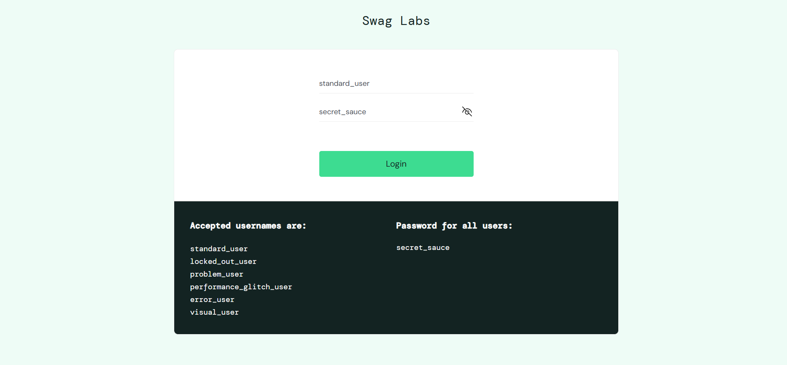
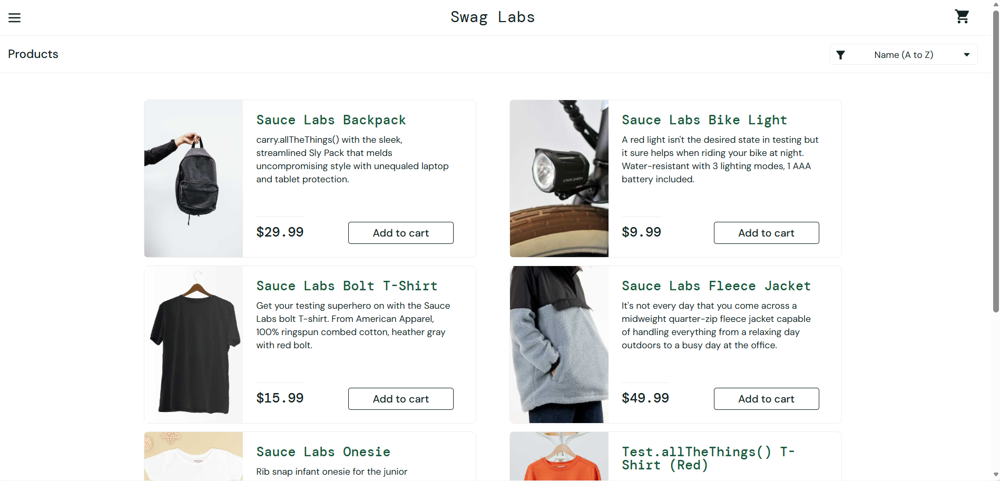
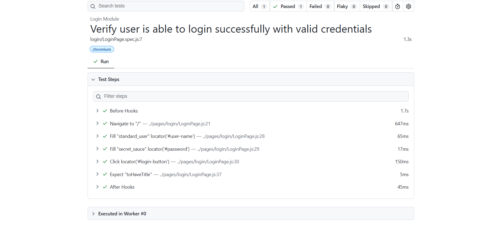

# 🚀 Task-001: Verify Successful Login | Playwright JavaScript Automation


---

# 📖 Project Overview

This project automates the **Successful Login** functionality of the **SauceDemo** web application using **Playwright with JavaScript**.

The objective of this task is to verify that a valid user can successfully log in to the application and is redirected to the Inventory page.

This automation is developed by following **IT Industry Standards** using the **Page Object Model (POM)** design pattern.

---

# 📌 Business Requirement

The application should allow registered users to log in using valid credentials.

After successful authentication, the application should redirect the user to the **Inventory (Products)** page.

---

# 🎯 Objective

To verify that a registered user can successfully log in using valid credentials.

---

# 📋 Test Case Information

| Field | Details |
|--------|---------|
| **Task ID** | TASK-001 |
| **Module** | Authentication |
| **Feature** | Login |
| **Scenario** | Successful Login |
| **Testing Type** | Functional Testing |
| **Automation** | Yes |
| **Priority** | High |
| **Severity** | Critical |
| **Framework** | Playwright |
| **Language** | JavaScript |
| **Design Pattern** | Page Object Model (POM) |
| **Execution Status** | ✅ Passed |

---

# 🌐 Application Under Test

| Property | Value |
|----------|-------|
| Application | SauceDemo |
| URL | https://www.saucedemo.com |
| Environment | Demo |

---

# 🛠 Technology Stack

| Technology | Details |
|------------|----------|
| Automation Tool | Playwright |
| Programming Language | JavaScript |
| Runtime | Node.js |
| IDE | Visual Studio Code |
| Version Control | Git |
| Repository | GitHub |
| Design Pattern | Page Object Model |

---

# 📁 Project Structure

```text
playwright-javascript-automation
│
├── pages
│   └── login
│       └── LoginPage.js
│
├── tests
│   └── login
│       └── LoginPage.spec.js
│
├── testdata
│   └── saucedemo_logindata.json
│
├── utils
│   └── constants.js
│
├── playwright.config.js
├── package.json
├── package-lock.json
├── .gitignore
└── README.md
```

---

# 📂 Folder Description

| Folder | Purpose |
|---------|----------|
| **pages** | Contains Page Object classes |
| **tests** | Contains Playwright test scripts |
| **testdata** | Stores JSON test data |
| **utils** | Stores reusable constants |
| **README.md** | Project documentation |

---

# 📌 Preconditions

- Node.js installed
- Playwright installed
- Browser dependencies installed
- Internet connection available
- SauceDemo website accessible
- Valid user credentials available

---

# 🧪 Test Data

| Username | Password |
|-----------|-----------|
| standard_user | secret_sauce |

---

# 📝 Test Steps

| Step | Action | Expected Result |
|------|----------|----------------|
| 1 | Launch Browser | Browser should launch successfully |
| 2 | Navigate to SauceDemo | Login page should be displayed |
| 3 | Enter Username | Username should be entered |
| 4 | Enter Password | Password should be entered |
| 5 | Click Login button | User should be authenticated |
| 6 | Verify Inventory Page | Products page should be displayed |

---

# 🔄 Test Flow

```
Launch Browser
       │
       ▼
Navigate to SauceDemo
       │
       ▼
Enter Username
       │
       ▼
Enter Password
       │
       ▼
Click Login
       │
       ▼
Verify Inventory Page
       │
       ▼
Test Passed
```

---

# ✅ Expected Result

- User should log in successfully.
- Inventory page should be displayed.
- URL should contain **inventory.html**.
- Products page title should be visible.

---

# 📌 Post Conditions

- User is successfully logged in.
- Products page is displayed.
- Application is ready for further actions.

---

# ⚙ Automation Approach

The automation is implemented using:

- Page Object Model (POM)
- External JSON Test Data
- Reusable Methods
- Playwright Assertions
- Async / Await Programming

---

# 🎯 Playwright Concepts Used

- Page Object Model (POM)
- Locators
- Assertions
- Async / Await
- JSON Test Data
- Browser Context
- Playwright Test Runner

---

# ✔ Assertions Used

- Verify Page URL
- Verify Inventory Page
- Verify Successful Login

---

# ▶ Test Execution

## Run all tests

```bash
npx playwright test
```

## Run Task-001

```bash
npx playwright test tests/login/LoginPage.spec.js --headed
```

## Run on Chromium

```bash
npx playwright test tests/login/LoginPage.spec.js --project=chromium
```

## View HTML Report

```bash
npx playwright show-report
```

---

# 🌍 Browser Support

| Browser | Status |
|----------|---------|
| Chromium | ✅ |
| Firefox | ✅ |
| WebKit | ✅ |

---

# 📊 Test Execution Summary

| Browser | Result |
|----------|---------|
| Chromium | ✅ Passed |

---

# 📷 Execution Evidence

## Login Page

> Add Screenshot Here

```
```


---

## ✅ Successful Login

> Add Screenshot Here

```
```



---

# 📈 Playwright HTML Report

> Add Report Screenshot Here

```
```


---

# 🌿 Git Information

### Branch

```
feature/task-001-login
```

### Commit Message

```
feat(login): automate successful login using Playwright POM
```

---

# 💡 Challenges Faced

- Understanding Playwright project structure
- Implementing Page Object Model
- Reading JSON test data
- Learning Playwright assertions

---

# 📚 Learning Outcome

After completing this task, I learned:

- Playwright project setup
- Page Object Model implementation
- Writing reusable automation code
- JSON Test Data handling
- Assertions in Playwright
- Git Feature Branch workflow
- GitHub repository management

---

# 🚀 Skills Demonstrated

- Playwright Automation
- JavaScript (ES6)
- Page Object Model (POM)
- Functional Testing
- JSON Test Data
- Assertions
- Git
- GitHub
- Version Control

---

# 🔜 Next Task

**Task-002**

✅ Verify Invalid Login Functionality

---

# 👨‍💻 Author

**Akash Atnure**

QA Automation Engineer

GitHub

```
https://github.com/<YOUR_GITHUB_USERNAME>
```

Repository

```
https://github.com/<YOUR_GITHUB_USERNAME>/playwright-javascript-automation
```

---

# ⭐ If you found this project helpful, don't forget to give it a Star.

---

# 📄 License

This project is created for learning, interview preparation, and portfolio purposes.