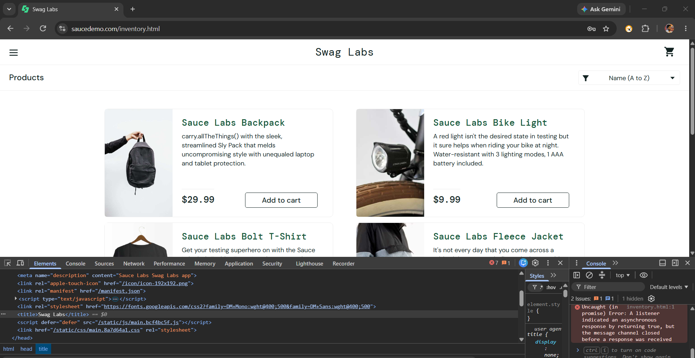
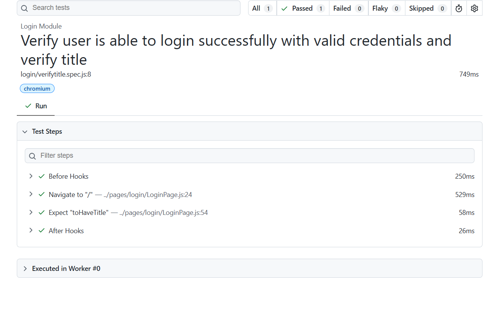

# 🚀 Task-003: Verify Login Page Title | Playwright JavaScript Automation


---

# 📖 Overview

This task automates the **Login Page Title Verification** of the SauceDemo web application using **Playwright with JavaScript**.

The automation validates that the application loads correctly and displays the expected page title **"Swag Labs"** before any user interaction.

The framework follows the **Page Object Model (POM)** design pattern and industry-standard automation practices.

---

# 🎯 Objective

Verify that the Login page displays the correct title when the application is launched.

---

# 🌐 Application Under Test

| Property | Details |
|-----------|---------|
| Application | SauceDemo |
| URL | https://www.saucedemo.com |
| Module | Login |
| Scenario | Verify Login Page Title |
| Environment | Demo |

---

# 📋 Test Case Details

| Field | Details |
|--------|---------|
| Task ID | TASK-003 |
| Module | Login |
| Test Scenario | Verify Login Page Title |
| Testing Type | Functional Testing |
| Automation Tool | Playwright |
| Programming Language | JavaScript |
| Framework | Playwright Test |
| Design Pattern | Page Object Model (POM) |
| Browser | Chromium |
| Priority | Medium |
| Severity | Medium |
| Status | ✅ Passed |

---

# 📌 Business Requirement

When a user opens the application, the Login page should load successfully and display the correct page title.

The title should be:

```
Swag Labs
```

---

# 🛠 Technology Stack

- Playwright
- JavaScript (ES6)
- Node.js
- Visual Studio Code
- Git
- GitHub
- Page Object Model (POM)

---

# 📂 Project Structure

```text
playwright-javascript-automation
│
├── pages
│   └── login
│       └── LoginPage.js
│
├── tests
│   └── login
│       ├── LoginPage.spec.js
│       ├── Invalid_Login.spec.js
│       └── verifytitle.spec.js
│
├── docs
│   └── task-003
│       ├── README.md
│       └── screenshots
│           ├── verify-title.png
│           └── playwright-report.png
│
├── testdata
├── utils
├── playwright.config.js
└── package.json
```

---

# 📝 Test Steps

| Step | Action | Expected Result |
|------|---------|----------------|
| 1 | Launch Browser | Browser launches successfully |
| 2 | Navigate to SauceDemo | Login page opens |
| 3 | Capture Page Title | Title should be retrieved |
| 4 | Verify Page Title | Title should be "Swag Labs" |

---

# 🔄 Test Flow

```text
Launch Browser
      │
      ▼
Navigate to SauceDemo
      │
      ▼
Capture Page Title
      │
      ▼
Compare Expected Title
      │
      ▼
Test Passed ✅
```

---

# ✅ Expected Result

- Login page should load successfully.
- Page title should be **Swag Labs**.

---

# ⚙ Automation Approach

- Page Object Model (POM)
- Reusable Navigation Method
- Playwright Assertions
- Async / Await
- Clean Folder Structure

---

# 🎯 Playwright Concepts Used

- Page Navigation
- Page Title Validation
- Assertions
- Page Object Model
- Async / Await
- Browser Automation

---

# ✔ Assertions Used

- Verify Login Page Title

---

# ▶ Test Execution

## Run Complete Test Suite

```bash
npx playwright test
```

---

## Run Only Task-003

```bash
npx playwright test tests/login/verifytitle.spec.js --project=chromium --headed
```

---

## View HTML Report

```bash
npx playwright show-report
```

---

# 🌍 Browser

| Browser | Status |
|----------|--------|
| Chromium | ✅ Passed |

---

# 📊 Test Execution Summary

| Browser | Result |
|----------|--------|
| Chromium | Passed |

---

# 📸 Screenshots

## Login Page Title Verification

The screenshot below shows successful verification of the Login page title.



---

## Playwright HTML Report

The screenshot below shows the successful execution of the automation test.



---

# 🌿 Git Information

### Repository

```
playwright-javascript-automation
```

### Branch

```
feature/task-003-verify-page-title
```

### Commit Message

```
feat(task-003): verify login page title using Playwright
```

---

# 📚 Challenges Faced

- Understanding Page Title validation.
- Using Playwright assertions.
- Organizing tests into separate specification files.
- Following Page Object Model practices.

---

# 🎓 Learning Outcome

After completing this task, I learned:

- Page Title Validation
- Playwright Assertions
- Navigation Methods
- Page Object Model
- Git Feature Branch Workflow
- GitHub Documentation

---

# 🚀 Skills Demonstrated

- Playwright Automation
- JavaScript
- Functional Testing
- UI Validation
- Assertions
- Page Object Model
- Git
- GitHub

---

# 🔜 Next Task

## Task-004

**Verify Login Page URL**

Status: ⏳ Pending

---

# 👨‍💻 Author

**Akash Atnure**

Aspiring QA Automation Engineer

GitHub

```
https://github.com/your-github-username
```

LinkedIn

```
https://linkedin.com/in/your-linkedin-profile
```

---

# ⭐ Support

If you found this project useful, please consider giving it a ⭐ on GitHub.

---

# 📄 License

This project is created for learning, portfolio building, interview preparation, and demonstrating Playwright Automation skills following industry best practices.