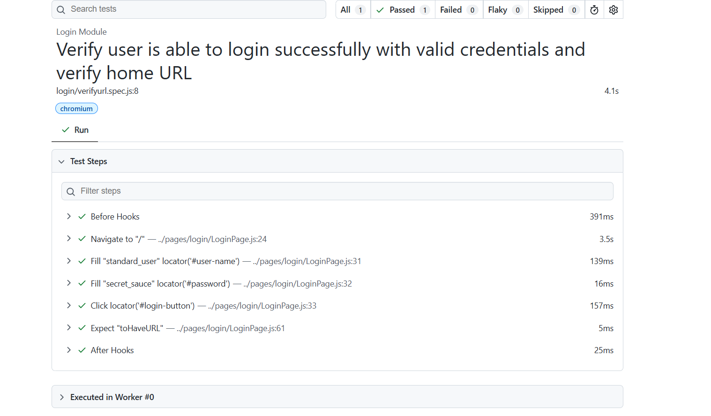
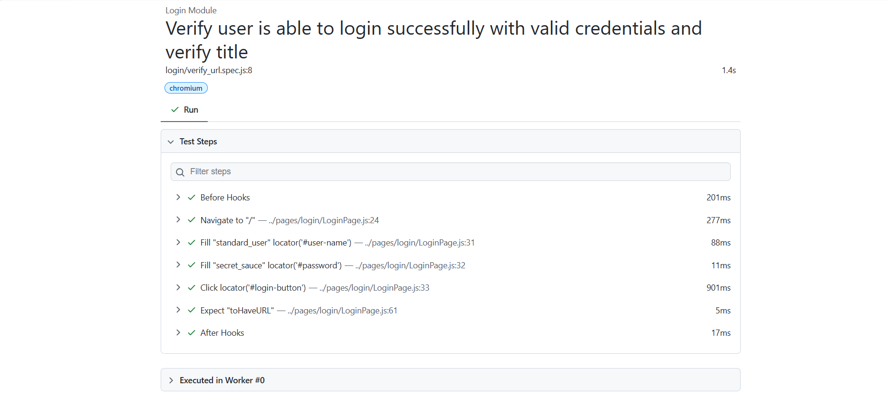

# 🚀 Task-004: Verify Login Page URL | Playwright JavaScript Automation


---

# 📖 Overview

This task automates the **Login Page URL Verification** of the **SauceDemo** web application using **Playwright with JavaScript**.

The automation validates that the application launches successfully and redirects users to the expected Login page URL.

The framework follows the **Page Object Model (POM)** design pattern and industry-standard automation practices.

---

# 🎯 Objective

Verify that the Login page URL is correct when the application is launched.

---

# 🌐 Application Under Test

| Property | Details |
|-----------|---------|
| Application | SauceDemo |
| URL | https://www.saucedemo.com |
| Module | Login |
| Scenario | Verify Login Page URL |
| Environment | Demo |

---

# 📋 Test Case Details

| Field | Details |
|--------|---------|
| Task ID | TASK-004 |
| Module | Login |
| Test Scenario | Verify Login Page URL |
| Testing Type | Functional Testing |
| Automation Tool | Playwright |
| Programming Language | JavaScript |
| Framework | Playwright Test |
| Design Pattern | Page Object Model (POM) |
| Browser | Chromium |
| Priority | Medium |
| Severity | Medium |
| Status | ✅ Passed |

---

# 📌 Business Requirement

When a user launches the application, the Login page should open successfully with the correct URL.

Expected URL:

```
https://www.saucedemo.com/
```

---

# 🛠 Technology Stack

- Playwright
- JavaScript (ES6)
- Node.js
- Visual Studio Code
- Git
- GitHub
- Page Object Model (POM)

---

# 📂 Project Structure

```text
playwright-javascript-automation
│
├── pages
│   └── login
│       └── LoginPage.js
│
├── tests
│   └── login
│       ├── LoginPage.spec.js
│       ├── Invalid_Login.spec.js
│       ├── verifytitle.spec.js
│       └── verifyurl.spec.js
│
├── docs
│   └── task-004
│       ├── README.md
│       └── screenshots
│           ├── verify-url.png
│           └── playwright-report.png
│
├── testdata
├── utils
├── playwright.config.js
├── package.json
└── package-lock.json
```

---

# 📝 Test Steps

| Step | Action | Expected Result |
|------|--------|-----------------|
| 1 | Launch Browser | Browser launches successfully |
| 2 | Navigate to SauceDemo | Login page opens |
| 3 | Capture Current URL | URL retrieved successfully |
| 4 | Verify URL | URL matches expected value |

---

# 🔄 Test Flow

```text
Launch Browser
      │
      ▼
Navigate to SauceDemo
      │
      ▼
Capture Current URL
      │
      ▼
Compare Expected URL
      │
      ▼
Test Passed ✅
```

---

# ✅ Expected Result

- Login page should load successfully.
- URL should be:

```
https://www.saucedemo.com/
```

---

# ⚙ Automation Approach

- Page Object Model (POM)
- Reusable Navigation Method
- Playwright Assertions
- Async / Await
- Clean Folder Structure

---

# 🎯 Playwright Concepts Used

- Page Navigation
- URL Validation
- Playwright Assertions
- Page Object Model
- Browser Automation
- Async / Await

---

# ✔ Assertions Used

- Verify Login Page URL using `toHaveURL()`

---

# ▶ Test Execution

### Run All Tests

```bash
npx playwright test
```

---

### Run Only Task-004

```bash
npx playwright test tests/login/verifyurl.spec.js --project=chromium --headed
```

---

### View HTML Report

```bash
npx playwright show-report
```

---

# 🌍 Browser

| Browser | Status |
|----------|--------|
| Chromium | ✅ Passed |

---

# 📊 Test Execution Summary

| Browser | Result |
|----------|--------|
| Chromium | Passed |

---

# 📸 Screenshots

## Login Page URL Verification

The screenshot below shows successful verification of the Login page URL.



---

## Playwright HTML Report

The screenshot below shows the successful execution of the automation test.



---

# 🌿 Git Information

### Repository

```
playwright-javascript-automation
```

### Branch

```
feature/task-004-verify-login-url
```

### Commit Message

```
feat(task-004): verify login page URL using Playwright
```

---

# 📚 Challenges Faced

- Understanding URL validation.
- Implementing reusable page methods.
- Using Playwright URL assertions.
- Maintaining clean project structure.

---

# 🎓 Learning Outcome

After completing this task, I learned:

- URL Validation
- Playwright `toHaveURL()` Assertion
- Browser Navigation
- Page Object Model
- Git Feature Branch Workflow
- GitHub Documentation

---

# 🚀 Skills Demonstrated

- Playwright Automation
- JavaScript
- Functional Testing
- URL Validation
- Assertions
- Page Object Model
- Git
- GitHub

---

# 🔜 Next Task

## Task-005

**Verify Login with Empty Username**

**Status:** ⏳ Pending

---

# 👨‍💻 Author

**Akash Atnure**

Aspiring QA Automation Engineer

**GitHub**

```
https://github.com/your-github-username
```

**LinkedIn**

```
https://linkedin.com/in/your-linkedin-profile
```

---

# ⭐ Support

If you found this project useful, please consider giving it a ⭐ on GitHub.

---

# 📄 License

This project is created for learning, portfolio building, interview preparation, and demonstrating Playwright Automation skills following industry-standard best practices.