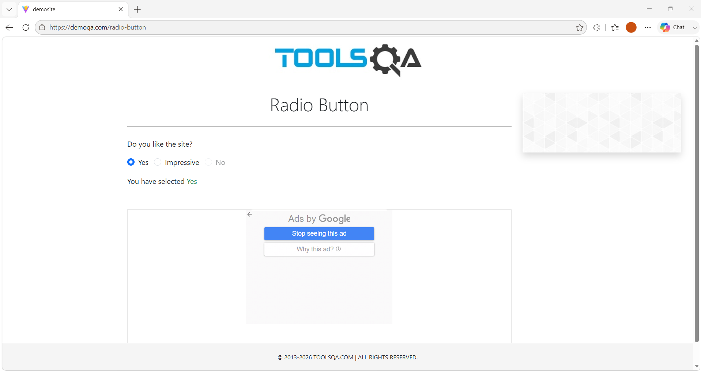
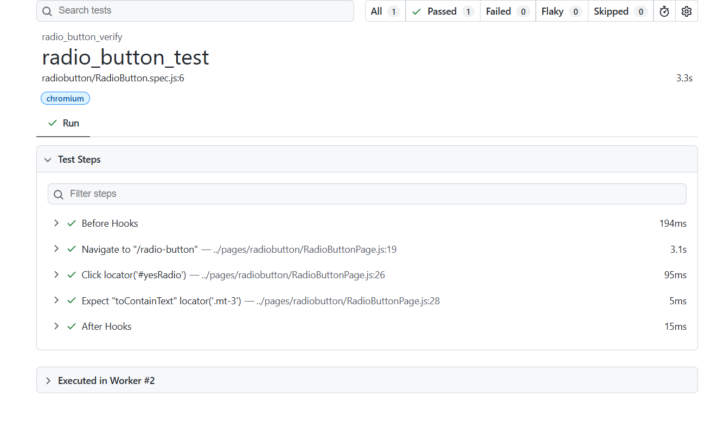

# 🚀 Task-005: Verify Radio Button Selection | Playwright JavaScript Automation


---

# 📖 Overview

This task automates the **Radio Button Selection** functionality of the **DemoQA** web application using **Playwright with JavaScript**.

The automation verifies that the user can successfully select the **"Yes"** radio button and validates the confirmation message displayed by the application.

The framework follows the **Page Object Model (POM)** design pattern and industry-standard automation practices.

---

# 🎯 Objective

Verify that the **Yes** radio button can be selected successfully and the application displays the correct confirmation message.

---

# 🌐 Application Under Test

| Property | Details |
|-----------|---------|
| Application | DemoQA |
| URL | https://demoqa.com/radio-button |
| Module | Radio Button |
| Scenario | Verify Radio Button Selection |
| Environment | Demo |

---

# 📋 Test Case Details

| Field | Details |
|--------|---------|
| Task ID | TASK-005 |
| Module | Radio Button |
| Test Scenario | Verify Radio Button Selection |
| Testing Type | Functional Testing |
| Automation Tool | Playwright |
| Programming Language | JavaScript |
| Framework | Playwright Test |
| Design Pattern | Page Object Model (POM) |
| Browser | Chromium |
| Priority | Medium |
| Severity | Medium |
| Status | ✅ Passed |

---

# 📌 Business Requirement

The application should allow users to select a radio button and display the corresponding selected value.

When the **Yes** radio button is selected:

- Radio button should be selected successfully.
- Confirmation message should display the selected value.

---

# 🛠 Technology Stack

- Playwright
- JavaScript (ES6)
- Node.js
- Visual Studio Code
- Git
- GitHub
- Page Object Model (POM)

---

# 📂 Project Structure

```text
playwright-javascript-automation
│
├── pages
│   └── radioButton
│       └── RadioButtonPage.js
│
├── tests
│   └── radioButton
│       └── RadioButton.spec.js
│
├── docs
│   └── task-005
│       ├── README.md
│       └── screenshots
│           ├── radio-button-selection.png
│           └── playwright-report.png
│
├── playwright.config.js
├── package.json
└── package-lock.json
```

---

# 📝 Test Steps

| Step | Action | Expected Result |
|------|--------|-----------------|
| 1 | Launch Browser | Browser launches successfully |
| 2 | Navigate to DemoQA Radio Button page | Page opens successfully |
| 3 | Click **Yes** Radio Button | Radio button is selected |
| 4 | Verify Success Message | "You have selected Yes" is displayed |

---

# 🔄 Test Flow

```text
Launch Browser
      │
      ▼
Navigate to DemoQA
      │
      ▼
Open Radio Button Page
      │
      ▼
Click Yes Radio Button
      │
      ▼
Verify Confirmation Message
      │
      ▼
Test Passed ✅
```

---

# ✅ Expected Result

- Yes radio button should be selected.
- Confirmation message should display:

```
You have selected Yes
```

---

# ⚙ Automation Approach

- Page Object Model (POM)
- Reusable Page Methods
- Playwright Assertions
- Clean Folder Structure
- Async / Await

---

# 🎯 Playwright Concepts Used

- Page Navigation
- Radio Button Interaction
- CSS Locators
- Assertions
- Browser Automation
- Async / Await

---

# ✔ Assertions Used

- Verify selected radio button value.

---

# ▶ Test Execution

### Run Test

```bash
npx playwright test tests/radioButton/RadioButton.spec.js --headed
```

### View HTML Report

```bash
npx playwright show-report
```

---

# 🌍 Browser

| Browser | Status |
|----------|--------|
| Chromium | ✅ Passed |

---

# 📊 Test Execution Summary

| Browser | Result |
|----------|--------|
| Chromium | Passed |

---

# 📸 Screenshots

## Radio Button Selection



---

## Playwright HTML Report



---

# 🌿 Git Information

### Repository

```
playwright-javascript-automation
```

### Branch

```
feature/task-005-radio-button-selection
```

### Commit Message

```
feat(task-005): automate radio button selection using Playwright
```

---

# 📚 Learning Outcome

After completing this task, I learned:

- Radio Button Automation
- Playwright Assertions
- Dynamic Text Validation
- Page Object Model
- Git Feature Branch Workflow
- GitHub Documentation

---

# 🚀 Skills Demonstrated

- Playwright Automation
- JavaScript
- Functional Testing
- UI Automation
- Assertions
- Page Object Model
- Git
- GitHub

---

# 🔜 Next Task

## Task-006

**Verify Checkbox Selection**

**Status:** ⏳ Pending

---

# 👨‍💻 Author

**Akash Atnure**

Aspiring QA Automation Engineer

GitHub

```
https://github.com/your-github-username
```

LinkedIn

```
https://linkedin.com/in/your-linkedin-profile
```

---

# ⭐ Support

If you found this project useful, please consider giving it a ⭐ on GitHub.

---

# 📄 License

This project is created for learning, portfolio building, interview preparation, and demonstrating Playwright Automation skills following industry best practices.