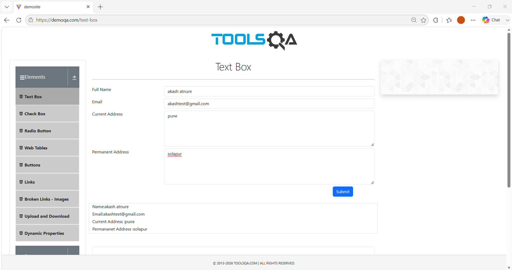
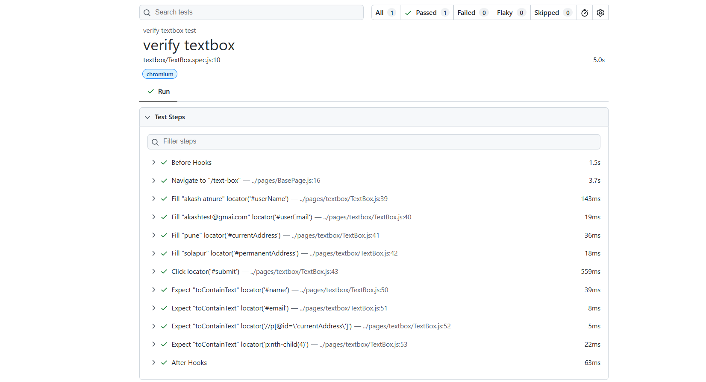

# 🚀 Task-006: Verify Text Box Submission | Playwright JavaScript Automation


---

# 📖 Overview

This task automates the **Text Box Submission** functionality of the **DemoQA** web application using **Playwright with JavaScript**.

The automation verifies that a user can successfully fill all required fields, submit the form, and validate the submitted data displayed on the page.

The framework follows **Page Object Model (POM)**, **Data-Driven Testing (JSON Test Data)**, reusable **BasePage**, and industry-standard automation practices.

---

# 🎯 Objective

Verify that users can submit the Text Box form successfully and validate all displayed values.

---

# 🌐 Application Under Test

| Property | Details |
|-----------|---------|
| Application | DemoQA |
| URL | https://demoqa.com/text-box |
| Module | Text Box |
| Scenario | Verify Text Box Submission |
| Environment | Demo |

---

# 📋 Test Case Details

| Field | Details |
|--------|---------|
| Task ID | TASK-006 |
| Module | Text Box |
| Test Scenario | Verify Text Box Submission |
| Testing Type | Functional Testing |
| Automation Tool | Playwright |
| Programming Language | JavaScript |
| Framework | Playwright Test |
| Design Pattern | Page Object Model (POM) |
| Test Data | JSON File |
| Browser | Chromium |
| Priority | High |
| Severity | High |
| Status | ✅ Passed |

---

# 📌 Business Requirement

The application should allow users to enter personal information into the Text Box form.

After clicking the **Submit** button:

- Full Name should be displayed.
- Email should be displayed.
- Current Address should be displayed.
- Permanent Address should be displayed.

---

# 🛠 Technology Stack

- Playwright
- JavaScript (ES6)
- Node.js
- Visual Studio Code
- Git
- GitHub
- JSON Test Data
- Page Object Model (POM)

---

# 📂 Project Structure

```text
playwright-javascript-automation
│
├── pages
│   ├── BasePage.js
│   └── textbox
│       └── TextBox.js
│
├── tests
│   └── textbox
│       └── TextBox.spec.js
│
├── testdata
│   └── demoqa_data.json
│
├── utils
│   └── constants.js
│
├── docs
│   └── task-006
│       ├── README.md
│       └── screenshots
│           ├── textbox-submission.png
│           └── playwright-report.png
│
├── playwright.config.js
├── package.json
└── package-lock.json
```

---

# 📝 Test Steps

| Step | Action | Expected Result |
|------|--------|-----------------|
| 1 | Launch Browser | Browser launches successfully |
| 2 | Navigate to DemoQA Text Box page | Page opens successfully |
| 3 | Enter Full Name | Value entered |
| 4 | Enter Email | Value entered |
| 5 | Enter Current Address | Value entered |
| 6 | Enter Permanent Address | Value entered |
| 7 | Click Submit | Form submitted successfully |
| 8 | Verify Submitted Data | All entered values displayed |

---

# 🔄 Test Flow

```text
Launch Browser
      │
      ▼
Navigate to DemoQA Text Box Page
      │
      ▼
Enter User Details
      │
      ▼
Click Submit
      │
      ▼
Verify Submitted Information
      │
      ▼
Test Passed ✅
```

---

# 📄 Test Data

| Field | Source |
|--------|--------|
| Full Name | demoqa_data.json |
| Email | demoqa_data.json |
| Current Address | demoqa_data.json |
| Permanent Address | demoqa_data.json |

---

# ✅ Expected Result

The application should display all submitted values correctly after the form is submitted.

---

# ⚙ Automation Approach

- Page Object Model (POM)
- Base Page for reusable methods
- JSON Test Data
- Playwright Assertions
- Async / Await
- Clean Folder Structure

---

# 🎯 Playwright Concepts Used

- Page Navigation
- Form Automation
- Fill Method
- Click Action
- Assertions
- JSON Data Handling
- Base Page
- POM

---

# ✔ Assertions Used

- Verify Full Name
- Verify Email
- Verify Current Address
- Verify Permanent Address

---

# ▶ Test Execution

### Run Text Box Test

```bash
npx playwright test tests/textbox/TextBox.spec.js --headed
```

### View HTML Report

```bash
npx playwright show-report
```

---

# 🌍 Browser

| Browser | Status |
|----------|--------|
| Chromium | ✅ Passed |

---

# 📊 Test Execution Summary

| Browser | Result |
|----------|--------|
| Chromium | Passed |

---

# 📸 Screenshots

## Text Box Submission



---

## Playwright HTML Report



---

# 🌿 Git Information

### Repository

```
playwright-javascript-automation
```

### Branch

```
feature/task-006-textbox-submission
```

### Commit Message

```
feat(task-006): automate text box submission using Playwright POM
```

---

# 📚 Learning Outcome

After completing this task, I learned:

- Form Automation
- Data-Driven Testing
- JSON Test Data
- Base Page Implementation
- Page Object Model
- Playwright Assertions
- Git Feature Branch Workflow

---

# 🚀 Skills Demonstrated

- Playwright Automation
- JavaScript
- Functional Testing
- Form Validation
- JSON Test Data
- Base Page Design
- Page Object Model
- Git
- GitHub

---

# 🔜 Next Task

## Task-007

**Verify Check Box Selection**

**Status:** ⏳ Pending

---

# 👨‍💻 Author

**Akash Atnure**

Aspiring QA Automation Engineer

GitHub

```
https://github.com/your-github-username
```

LinkedIn

```
https://linkedin.com/in/your-linkedin-profile
```

---

# ⭐ Support

If you found this project useful, please consider giving it a ⭐ on GitHub.

---

# 📄 License

This project is created for learning, portfolio building, interview preparation, and demonstrating Playwright Automation skills following industry best practices.