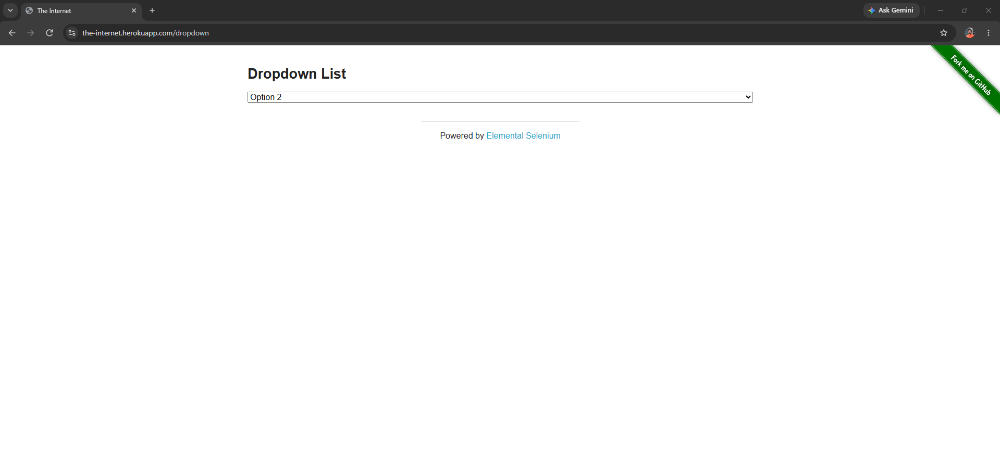
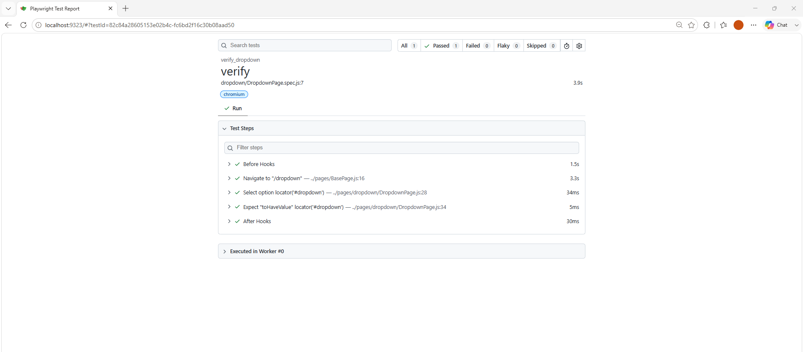

# 🚀 Task-007: Verify Dropdown Selection | Playwright JavaScript Automation


---

# 📖 Overview

This task automates the **Dropdown Selection** functionality of **The Internet Herokuapp** using **Playwright with JavaScript**.

The automation verifies that the user can successfully select **Option 2** from the dropdown and validates that the selected value is displayed correctly.

The framework follows **Page Object Model (POM)**, **Base Page Design**, **JSON Test Data**, and industry-standard automation practices.

---

# 🎯 Objective

Verify that a user can select an option from the dropdown list and confirm the selected value.

---

# 🌐 Application Under Test

| Property | Details |
|-----------|---------|
| Application | The Internet Herokuapp |
| URL | https://the-internet.herokuapp.com/dropdown |
| Module | Dropdown |
| Scenario | Verify Dropdown Selection |
| Environment | Demo |

---

# 📋 Test Case Details

| Field | Details |
|--------|---------|
| Task ID | TASK-007 |
| Module | Dropdown |
| Test Scenario | Verify Dropdown Selection |
| Testing Type | Functional Testing |
| Automation Tool | Playwright |
| Programming Language | JavaScript |
| Framework | Playwright Test |
| Design Pattern | Page Object Model (POM) |
| Test Data | JSON File |
| Browser | Chromium |
| Priority | Medium |
| Severity | Medium |
| Status | ✅ Passed |

---

# 📌 Business Requirement

The application should allow users to select an option from the dropdown.

After selecting **Option 2**, the dropdown should display the selected option correctly.

---

# 🛠 Technology Stack

- Playwright
- JavaScript (ES6)
- Node.js
- Visual Studio Code
- Git
- GitHub
- JSON Test Data
- Page Object Model (POM)

---

# 📂 Project Structure

```text
playwright-javascript-automation
│
├── pages
│   ├── BasePage.js
│   └── dropdown
│       └── DropdownPage.js
│
├── tests
│   └── dropdown
│       └── DropdownPage.spec.js
│
├── testdata
│   └── dropdown_data.json
│
├── utils
│   └── constants.js
│
├── docs
│   └── task-007
│       ├── README.md
│       └── screenshots
│           ├── dropdown-selection.png
│           └── playwright-report.png
│
├── playwright.config.js
├── package.json
└── package-lock.json
```

---

# 📝 Test Steps

| Step | Action | Expected Result |
|------|--------|-----------------|
| 1 | Launch Browser | Browser launches successfully |
| 2 | Navigate to Dropdown page | Page opens successfully |
| 3 | Select Option 2 | Option selected successfully |
| 4 | Verify Selected Value | Option 2 is displayed |

---

# 🔄 Test Flow

```text
Launch Browser
      │
      ▼
Navigate to Dropdown Page
      │
      ▼
Select Option 2
      │
      ▼
Verify Selected Value
      │
      ▼
Test Passed ✅
```

---

# 📄 Test Data

| Field | Source |
|--------|--------|
| Dropdown Option | dropdown_data.json |

---

# ✅ Expected Result

The selected dropdown option should be displayed as **Option 2**.

---

# ⚙ Automation Approach

- Page Object Model (POM)
- Base Page
- JSON Test Data
- Playwright Assertions
- Async / Await

---

# 🎯 Playwright Concepts Used

- selectOption()
- toHaveValue()
- Page Object Model
- Base Page
- JSON Data
- Assertions

---

# ✔ Assertions Used

- Verify selected dropdown value.

---

# ▶ Test Execution

### Run Test

```bash
npx playwright test tests/dropdown/DropdownPage.spec.js --headed
```

### View HTML Report

```bash
npx playwright show-report
```

---

# 🌍 Browser

| Browser | Status |
|----------|--------|
| Chromium | ✅ Passed |

---

# 📊 Test Execution Summary

| Browser | Result |
|----------|--------|
| Chromium | Passed |

---

# 📸 Screenshots

## Dropdown Selection



---

## Playwright HTML Report



---

# 🌿 Git Information

### Repository

```
playwright-javascript-automation
```

### Branch

```
feature/task-007-dropdown-selection
```

### Commit Message

```
feat(task-007): automate dropdown selection using Playwright POM
```

---

# 📚 Learning Outcome

After completing this task, I learned:

- Dropdown Automation
- selectOption()
- JSON Test Data
- Base Page
- Page Object Model
- Playwright Assertions
- Git Feature Branch Workflow

---

# 🚀 Skills Demonstrated

- Playwright Automation
- JavaScript
- Functional Testing
- Dropdown Automation
- JSON Test Data
- Page Object Model
- Base Page
- Git
- GitHub

---

# 🔜 Next Task

## Task-008

**Verify Checkbox Selection**

**Status:** ⏳ Pending

---

# 👨‍💻 Author

**Akash Atnure**

Aspiring QA Automation Engineer

GitHub

```
https://github.com/your-github-username
```

LinkedIn

```
https://linkedin.com/in/your-linkedin-profile
```

---

# ⭐ Support

If you found this project useful, please consider giving it a ⭐ on GitHub.

---

# 📄 License

This project is created for learning, portfolio building, interview preparation, and demonstrating Playwright Automation skills following industry best practices.