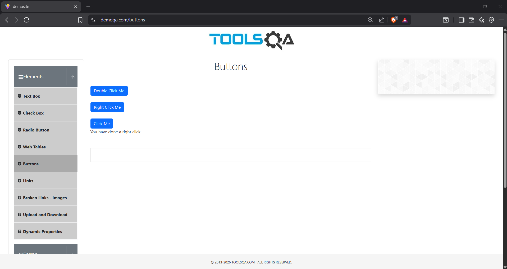
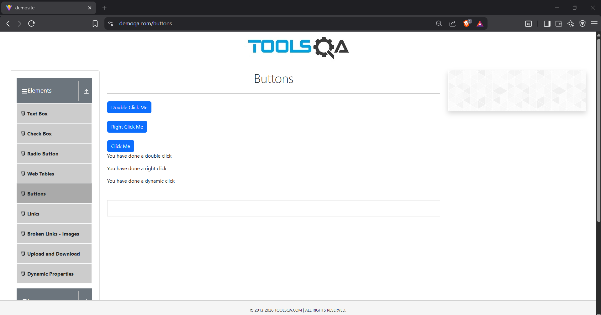
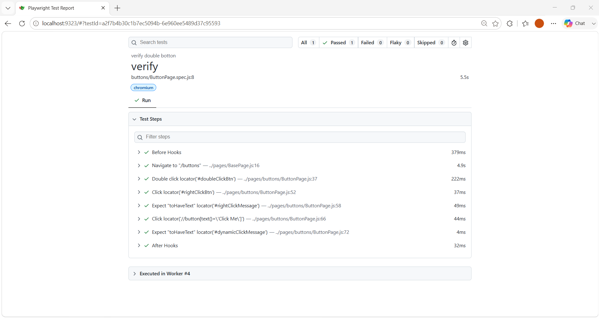

# 🚀 Task-008: Verify Button Actions | Playwright JavaScript Automation


---

# 📖 Project Overview

This project automates the **Button Actions** functionality of the **DemoQA** web application using **Playwright with JavaScript**.

The objective of this task is to verify different mouse click operations including **Double Click**, **Right Click**, and **Dynamic Click** by validating their respective success messages.

The automation framework is developed by following **IT Industry Standards** using the **Page Object Model (POM)** design pattern.

---

# 📌 Business Requirement

The application should allow users to perform different mouse click operations on buttons.

After each action, the application should display the appropriate success message.

---

# 🎯 Objective

To verify that all button click operations work correctly and display the expected success messages.

---

# 📋 Test Case Information

| Field | Details |
|--------|---------|
| **Task ID** | TASK-008 |
| **Module** | Elements |
| **Feature** | Buttons |
| **Scenario** | Verify Button Actions |
| **Testing Type** | Functional Testing |
| **Automation** | Yes |
| **Priority** | High |
| **Severity** | Medium |
| **Framework** | Playwright |
| **Language** | JavaScript |
| **Design Pattern** | Page Object Model (POM) |
| **Execution Status** | ✅ Passed |

---

# 🌐 Application Under Test

| Property | Value |
|----------|-------|
| Application | DemoQA |
| URL | https://demoqa.com/buttons |
| Environment | Demo |

---

# 🛠 Technology Stack

| Technology | Details |
|------------|----------|
| Automation Tool | Playwright |
| Programming Language | JavaScript |
| Runtime | Node.js |
| IDE | Visual Studio Code |
| Version Control | Git |
| Repository | GitHub |
| Design Pattern | Page Object Model |

---

# 📁 Project Structure

```text
playwright-javascript-automation
│
├── pages
│   ├── BasePage.js
│   └── buttons
│       └── ButtonPage.js
│
├── tests
│   └── buttons
│       └── ButtonPage.spec.js
│
├── testdata
│   └── button_data.json
│
├── utils
│   └── constants.js
│
├── playwright.config.js
├── package.json
├── package-lock.json
├── .gitignore
└── README.md
```

---

# 📂 Folder Description

| Folder | Purpose |
|---------|----------|
| **pages** | Contains Page Object classes |
| **tests** | Contains Playwright test scripts |
| **testdata** | Stores JSON test data |
| **utils** | Stores reusable constants |
| **README.md** | Project documentation |

---

# 📌 Preconditions

- Node.js installed
- Playwright installed
- Browser dependencies installed
- Internet connection available
- DemoQA website accessible

---

# 🧪 Test Data

| Action | Expected Message |
|----------|----------------|
| Double Click | You have done a double click |
| Right Click | You have done a right click |
| Dynamic Click | You have done a dynamic click |

---

# 📝 Test Steps

| Step | Action | Expected Result |
|------|----------|----------------|
| 1 | Launch Browser | Browser launches successfully |
| 2 | Navigate to DemoQA Buttons page | Buttons page displayed |
| 3 | Perform Double Click | Success message displayed |
| 4 | Perform Right Click | Success message displayed |
| 5 | Perform Dynamic Click | Success message displayed |
| 6 | Verify all messages | Validation successful |

---

# 🔄 Test Flow

```
Launch Browser
       │
       ▼
Navigate to DemoQA Buttons Page
       │
       ▼
Perform Double Click
       │
       ▼
Verify Success Message
       │
       ▼
Perform Right Click
       │
       ▼
Verify Success Message
       │
       ▼
Perform Dynamic Click
       │
       ▼
Verify Success Message
       │
       ▼
Test Passed
```

---

# ✅ Expected Result

- Double Click should display the correct success message.
- Right Click should display the correct success message.
- Dynamic Click should display the correct success message.
- All assertions should pass successfully.

---

# 📌 Post Conditions

- All button actions executed successfully.
- Expected success messages displayed.
- Test execution completed without failures.

---

# ⚙ Automation Approach

The automation is implemented using:

- Page Object Model (POM)
- Base Page
- External JSON Test Data
- Reusable Methods
- Playwright Assertions
- Async / Await Programming

---

# 🎯 Playwright Concepts Used

- Page Object Model (POM)
- Locators
- Assertions
- Async / Await
- JSON Test Data
- Browser Context
- Mouse Actions
- Double Click
- Right Click
- Playwright Test Runner

---

# ✔ Assertions Used

- Verify Double Click Message
- Verify Right Click Message
- Verify Dynamic Click Message

---

# ▶ Test Execution

## Run all tests

```bash
npx playwright test
```

## Run Task-008

```bash
npx playwright test tests/buttons/ButtonPage.spec.js --headed
```

## Run on Chromium

```bash
npx playwright test tests/buttons/ButtonPage.spec.js --project=chromium
```

## View HTML Report

```bash
npx playwright show-report
```

---

# 🌍 Browser Support

| Browser | Status |
|----------|---------|
| Chromium | ✅ |
| Firefox | ✅ |
| WebKit | ✅ |

---

# 📊 Test Execution Summary

| Browser | Result |
|----------|---------|
| Chromium | ✅ Passed |

---

# 📷 Execution Evidence

## Double Click

> Add Screenshot Here


---

## Right Click

> Add Screenshot Here



---

## Dynamic Click

> Add Screenshot Here


---

## Successful Execution

> Add Screenshot Here



---

# 📈 Playwright HTML Report

> Add Report Screenshot Here



---

# 🌿 Git Information

### Branch

```
feature/task-008-button-actions
```

### Commit Message

```
feat(task-008): automate button actions using Playwright POM
```

---

# 💡 Challenges Faced

- Understanding different mouse actions
- Handling dynamic button interactions
- Implementing reusable methods
- Validating multiple success messages

---

# 📚 Learning Outcome

After completing this task, I learned:

- Double Click automation
- Right Click automation
- Dynamic Click automation
- Mouse Actions in Playwright
- Page Object Model implementation
- JSON Test Data handling
- Playwright Assertions
- Git Feature Branch workflow
- GitHub repository management

---

# 🚀 Skills Demonstrated

- Playwright Automation
- JavaScript (ES6)
- Page Object Model (POM)
- Functional Testing
- Mouse Actions
- JSON Test Data
- Assertions
- Git
- GitHub
- Version Control

---

# 🔜 Next Task

**Task-009**

✅ Verify Web Table Functionality

---

# 👨‍💻 Author

**Akash Atnure**

QA Automation Engineer

GitHub

```
https://github.com/<YOUR_GITHUB_USERNAME>
```

Repository

```
https://github.com/<YOUR_GITHUB_USERNAME>/playwright-javascript-automation
```

---

# ⭐ If you found this project helpful, don't forget to give it a Star.

---

# 📄 License

This project is created for learning, interview preparation, and portfolio purposes.