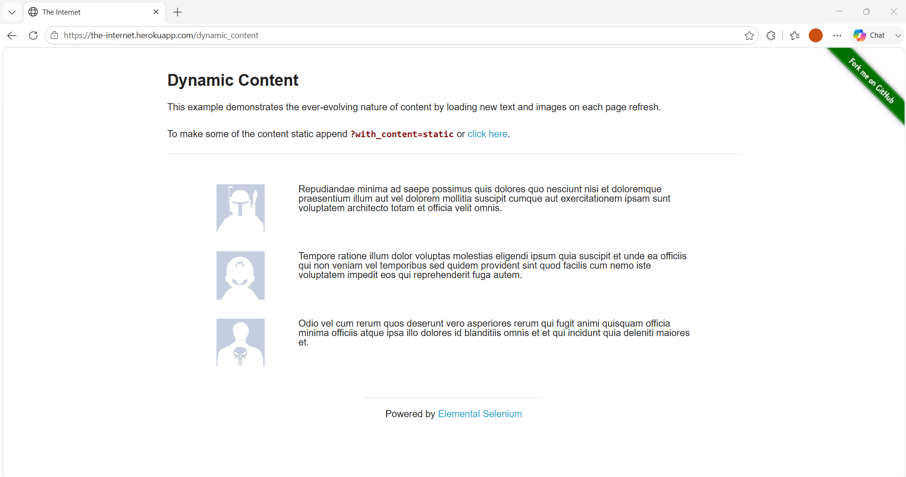
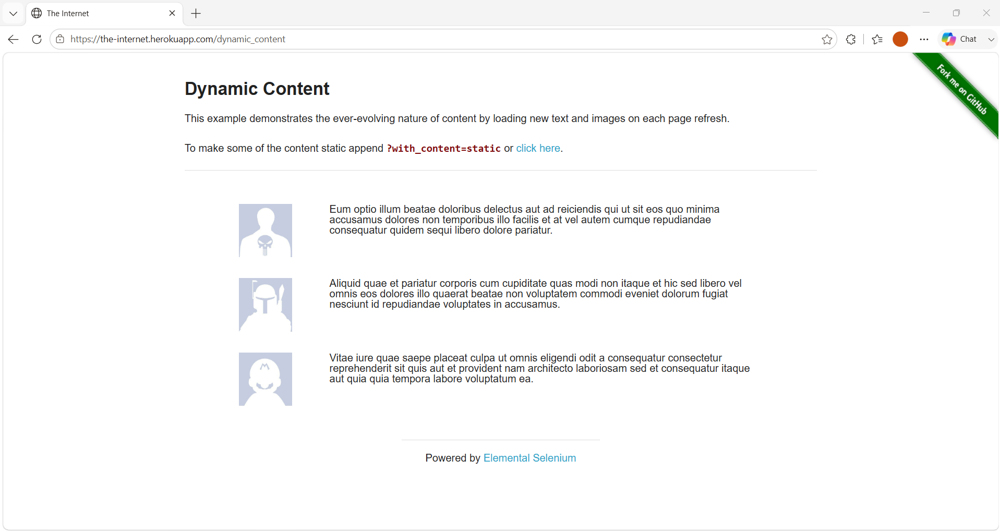
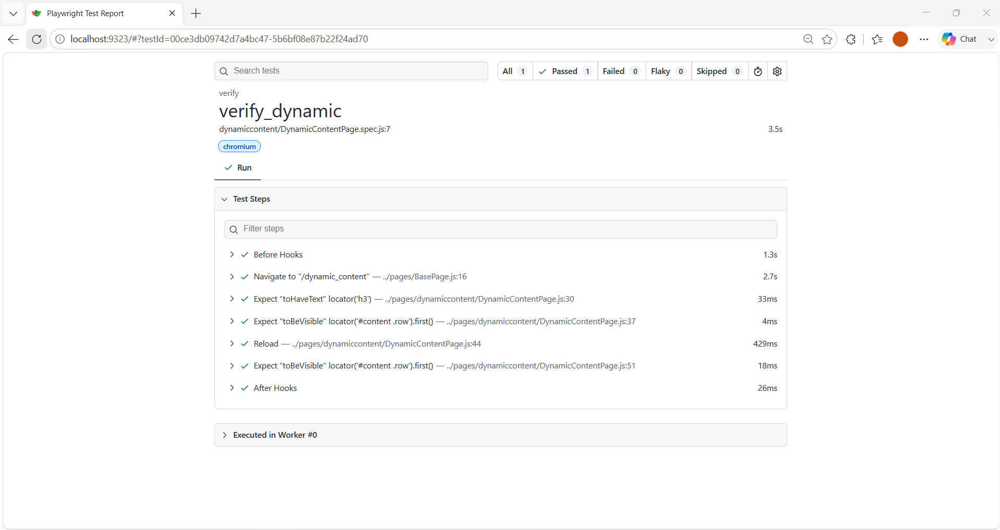

# 🚀 Task-009: Verify Dynamic Content | Playwright JavaScript Automation


---

# 📖 Project Overview

This project automates the **Dynamic Content** functionality of **The Internet HerokuApp** using **Playwright with JavaScript**.

The objective of this task is to verify that the Dynamic Content page loads successfully, displays the heading correctly, and continues to display content after refreshing the page.

The automation framework follows **IT Industry Standards** using the **Page Object Model (POM)** design pattern.

---

# 📌 Business Requirement

The application should display dynamic content successfully every time the page is loaded or refreshed.

Users should always be able to view the available content blocks.

---

# 🎯 Objective

Verify that:

- Dynamic Content page loads successfully.
- Page heading is displayed correctly.
- Dynamic content blocks are visible.
- Content remains visible after page refresh.

---

# 📋 Test Case Information

| Field | Details |
|--------|---------|
| **Task ID** | TASK-009 |
| **Module** | Dynamic Content |
| **Feature** | Dynamic Content Verification |
| **Testing Type** | Functional Testing |
| **Automation** | Yes |
| **Priority** | Medium |
| **Severity** | Medium |
| **Framework** | Playwright |
| **Language** | JavaScript |
| **Design Pattern** | Page Object Model (POM) |
| **Execution Status** | ✅ Passed |

---

# 🌐 Application Under Test

| Property | Value |
|----------|-------|
| Application | The Internet HerokuApp |
| URL | https://the-internet.herokuapp.com/dynamic_content |
| Environment | Demo |

---

# 🛠 Technology Stack

| Technology | Details |
|------------|----------|
| Automation Tool | Playwright |
| Programming Language | JavaScript |
| Runtime | Node.js |
| IDE | Visual Studio Code |
| Version Control | Git |
| Repository | GitHub |
| Design Pattern | Page Object Model |

---

# 📁 Project Structure

```text
playwright-javascript-automation
│
├── pages
│   └── dynamiccontent
│       └── DynamicContentPage.js
│
├── tests
│   └── dynamiccontent
│       └── DynamicContentPage.spec.js
│
├── testdata
│   └── dynamic_content_data.json
│
├── utils
│   └── constants.js
│
├── docs
│   └── task-009
│       └── README.md
│
├── playwright.config.js
├── package.json
└── README.md
```

---

# 📂 Folder Description

| Folder | Purpose |
|---------|----------|
| pages | Contains Page Object classes |
| tests | Contains Playwright test scripts |
| testdata | Stores JSON test data |
| utils | Stores reusable constants |
| docs | Project documentation |

---

# 📌 Preconditions

- Node.js installed
- Playwright installed
- Internet connection available
- Browser dependencies installed

---

# 🧪 Test Data

| Field | Value |
|-------|-------|
| Expected Heading | Dynamic Content |

---

# 📝 Test Steps

| Step | Action | Expected Result |
|------|----------|----------------|
| 1 | Launch Browser | Browser opens successfully |
| 2 | Navigate to Dynamic Content page | Page loads |
| 3 | Verify Heading | Heading displayed |
| 4 | Verify Content Block | Dynamic content visible |
| 5 | Refresh Page | Page reloads successfully |
| 6 | Verify Content Again | Content still displayed |

---

# 🔄 Test Flow

```
Launch Browser
      │
      ▼
Navigate to Dynamic Content Page
      │
      ▼
Verify Heading
      │
      ▼
Verify Content
      │
      ▼
Refresh Page
      │
      ▼
Verify Content After Refresh
      │
      ▼
Test Passed
```

---

# ✅ Expected Result

- Dynamic Content page loads.
- Heading is displayed correctly.
- Dynamic content block is visible.
- Content remains visible after refreshing.

---

# ⚙ Automation Approach

- Page Object Model
- Base Page
- JSON Test Data
- Playwright Assertions
- Async / Await
- Reusable Methods

---

# 🎯 Playwright Concepts Used

- Page Reload
- Locator
- Assertions
- Page Object Model
- JSON Test Data
- Base Page

---

# ✔ Assertions Used

- Verify Page Heading
- Verify Content Visibility
- Verify Content After Refresh

---

# ▶ Test Execution

## Run Task-009

```bash
npx playwright test tests/dynamiccontent/DynamicContentPage.spec.js --project=chromium --headed
```

## View HTML Report

```bash
npx playwright show-report
```

---

# 🌍 Browser Support

| Browser | Status |
|----------|---------|
| Chromium | ✅ |
| Firefox | ✅ |
| WebKit | ✅ |

---

# 📊 Test Execution Summary

| Browser | Result |
|----------|---------|
| Chromium | ✅ Passed |

---

# 📷 Execution Evidence

## Dynamic Content Page



---

## Page After Refresh



---

## Playwright HTML Report



---

# 🌿 Git Information

### Branch

```
feature/task-009-dynamic-content
```

### Commit Message

```
feat(task-009): automate dynamic content verification using Playwright POM
```

---

# 💡 Learning Outcome

- Dynamic content validation
- Page reload in Playwright
- Visibility assertions
- Reusable methods
- Page Object Model
- JSON Test Data

---

# 🚀 Skills Demonstrated

- Playwright
- JavaScript
- Page Object Model
- Functional Testing
- Assertions
- Git
- GitHub

---

# 🔜 Next Task

**Task-010**

✅ Verify Checkbox Selection

---

# 👨‍💻 Author

**Akash Atnure**

QA Automation Engineer

GitHub

```
https://github.com/<YOUR_GITHUB_USERNAME>
```

Repository

```
https://github.com/<YOUR_GITHUB_USERNAME>/playwright-javascript-automation
```

---

# ⭐ If you found this project helpful, don't forget to give it a Star.

---

# 📄 License

This project is created for learning, interview preparation, and portfolio purposes.