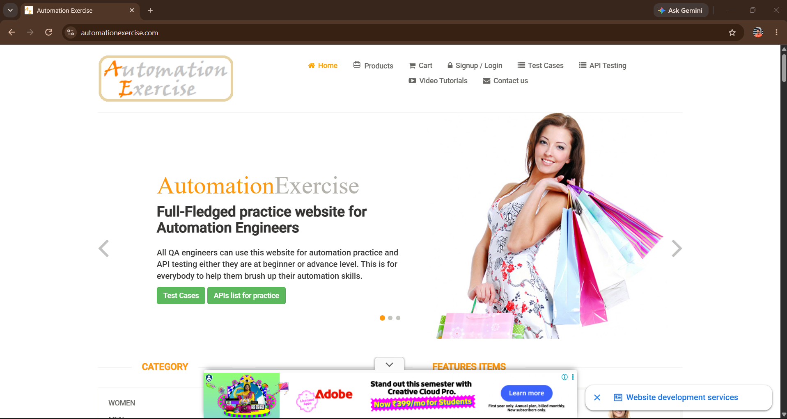
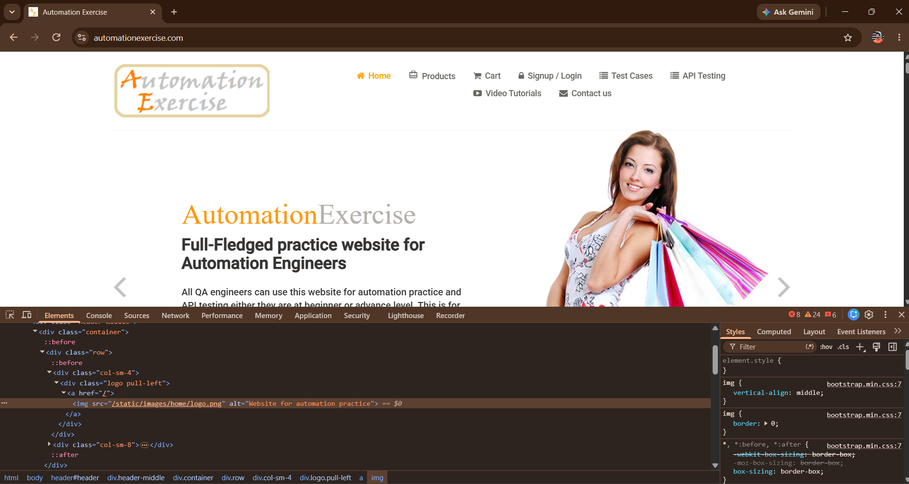
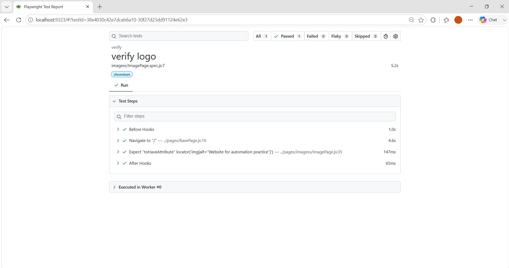

# 🚀 Task-010: Verify Image Presence | Playwright JavaScript Automation


---

# 📖 Project Overview

This project automates the **Image Presence Verification** functionality of the **Automation Exercise** website using **Playwright with JavaScript**.

The objective of this task is to verify that the website logo is displayed successfully after navigating to the application.

The automation is developed following **IT Industry Standards** using the **Page Object Model (POM)** design pattern.

---

# 📌 Business Requirement

The application should display the company logo on the homepage.

The logo should be visible immediately after the page loads.

---

# 🎯 Objective

To verify that the homepage logo is displayed successfully.

---

# 📋 Test Case Information

| Field | Details |
|--------|---------|
| **Task ID** | TASK-010 |
| **Module** | Home Page |
| **Feature** | Image Verification |
| **Scenario** | Verify Logo Visibility |
| **Testing Type** | Functional Testing |
| **Automation** | Yes |
| **Priority** | Medium |
| **Severity** | Medium |
| **Framework** | Playwright |
| **Language** | JavaScript |
| **Design Pattern** | Page Object Model (POM) |
| **Execution Status** | ✅ Passed |

---

# 🌐 Application Under Test

| Property | Value |
|----------|-------|
| Application | Automation Exercise |
| URL | https://automationexercise.com |
| Environment | Demo |

---

# 🛠 Technology Stack

| Technology | Details |
|------------|----------|
| Automation Tool | Playwright |
| Programming Language | JavaScript |
| Runtime | Node.js |
| IDE | Visual Studio Code |
| Version Control | Git |
| Repository | GitHub |
| Design Pattern | Page Object Model |

---

# 📁 Project Structure

```text
playwright-javascript-automation
│
├── pages
│   └── imagess
│       └── ImagePage.js
│
├── tests
│   └── imagess
│       └── ImagePage.spec.js
│
├── testdata
│   └── imagess_data.json
│
├── utils
│   └── constants.js
│
├── playwright.config.js
├── package.json
├── package-lock.json
├── .gitignore
└── README.md
```

---

# 📂 Folder Description

| Folder | Purpose |
|---------|----------|
| **pages** | Contains Page Object classes |
| **tests** | Contains Playwright test scripts |
| **testdata** | Stores JSON test data |
| **utils** | Stores reusable constants |
| **README.md** | Project documentation |

---

# 📌 Preconditions

- Node.js installed
- Playwright installed
- Browser dependencies installed
- Internet connection available
- Automation Exercise website accessible

---

# 🧪 Test Data

| Property | Value |
|-----------|-------|
| Expected Alt Text | Website for automation practice |

---

# 📝 Test Steps

| Step | Action | Expected Result |
|------|----------|----------------|
| 1 | Launch Browser | Browser should launch successfully |
| 2 | Navigate to Automation Exercise | Homepage should load |
| 3 | Locate Website Logo | Logo should be visible |
| 4 | Verify Logo Alt Attribute | Alt text should match expected value |

---

# 🔄 Test Flow

```
Launch Browser
      │
      ▼
Navigate to Website
      │
      ▼
Locate Logo
      │
      ▼
Verify Logo Visibility
      │
      ▼
Verify Alt Attribute
      │
      ▼
Test Passed
```

---

# ✅ Expected Result

- Website logo should be visible.
- Logo should contain the correct **Alt** attribute.
- Image should load successfully.

---

# 📌 Post Conditions

- Homepage loaded successfully.
- Logo verified successfully.

---

# ⚙ Automation Approach

The automation is implemented using:

- Page Object Model (POM)
- External JSON Test Data
- Reusable Methods
- Playwright Assertions
- Async / Await Programming

---

# 🎯 Playwright Concepts Used

- Page Object Model (POM)
- Locators
- Assertions
- Async / Await
- JSON Test Data
- Browser Context
- Playwright Test Runner

---

# ✔ Assertions Used

- Verify Image Visibility
- Verify Image Alt Attribute

---

# ▶ Test Execution

## Run all tests

```bash
npx playwright test
```

## Run Task-010

```bash
npx playwright test tests/imagess/ImagePage.spec.js --headed
```

## Run on Chromium

```bash
npx playwright test tests/imagess/ImagePage.spec.js --project=chromium
```

## View HTML Report

```bash
npx playwright show-report
```

---

# 🌍 Browser Support

| Browser | Status |
|----------|---------|
| Chromium | ✅ |
| Firefox | ✅ |
| WebKit | ✅ |

---

# 📊 Test Execution Summary

| Browser | Result |
|----------|---------|
| Chromium | ✅ Passed |

---

# 📷 Execution Evidence

## Homepage



---

## Logo Verification



---

## Playwright HTML Report



---

# 🌿 Git Information

### Branch

```
feature/task-010-image-presence
```

### Commit Message

```
feat(task-010): automate image presence verification using Playwright POM
```

---

# 💡 Challenges Faced

- Identifying the correct image locator.
- Verifying image visibility.
- Validating image attributes.

---

# 📚 Learning Outcome

After completing this task, I learned:

- Image element verification
- Visibility assertions
- Attribute validation
- Reusable Page Object methods
- JSON data handling
- Git feature branch workflow

---

# 🚀 Skills Demonstrated

- Playwright Automation
- JavaScript (ES6)
- Page Object Model (POM)
- Functional Testing
- Image Validation
- Assertions
- Git
- GitHub
- Version Control

---

# 🔜 Next Task

**Task-011**

✅ Verify Checkbox Selection

---

# 👨‍💻 Author

**Akash Atnure**

QA Automation Engineer

GitHub

```
https://github.com/<YOUR_GITHUB_USERNAME>
```

Repository

```
https://github.com/<YOUR_GITHUB_USERNAME>/playwright-javascript-automation
```

---

# ⭐ If you found this project helpful, don't forget to give it a Star.

---

# 📄 License

This project is created for learning, interview preparation, and portfolio purposes.